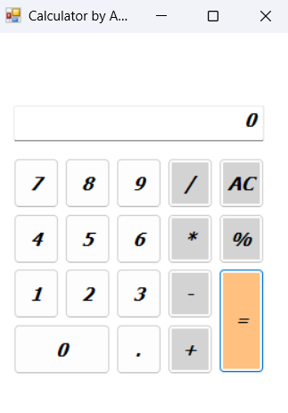

# Calculator

A simple calculator application developed using **C#** and **Windows Forms**.

## Screenshot

## Features

- Addition (+)
- Subtraction (-)
- Multiplication (×)
- Division (÷)
- Percentage (%)
- Decimal Point (.)
- Clear (C)
- User-friendly graphical interface

## Technologies Used

- C#
- Windows Forms
- .NET Framework

## How to Run

1. Clone the repository.
2. Open `Calculator Form.sln` using Visual Studio.
3. Build and run the project.

## Author

Ahmed Ashraf